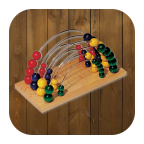

# Bummerlzähler
Wous? Open Source Bummerlzähler?? Bistu moped schau tatsächlich!

 
## Keinen Zettel bei der Hand? Nirgends ein Bummerlzähler? Schlechtes Kurzzeitgedächtnis?

Dann ist diese App genau richtig für dich! Für jeden der lieber mit echten Karten spielt, aber trotzdem die digitale Welt nicht so gern aus der Hand gibt.

Jeder kennt die Situation - Lage 153, der Abrüstungstermin liegt in weiter Ferne und es ist wieder Zeit für "Eigenstudium". Doch die Angst ist groß, denn kein Zettel weit und breit und jeder hat sich sein letztes bisschen Gedächtnis auch noch versoffen. Aber kein Grund zum Schwitzen, denn der Wachmeister ist fern, die Schnapskarten sind warm und zum Mitzählen liegt nun endlich auch das Handy bereit.

Durch die Verwendung hochkomplexer mathematischer Formeln wird das Zusammenzählen noch vereinfacht und für den typischen Schnapsenkönig digitalisiert. Auch wenn du Bummerl über Bummerl beim Schnapsen / Schnopsen verlierst, mit dieser App wirst du zum Kaiser auserkoren.

## Was kann die App dir bieten?
- Du solltest dir lieber fragen was kann ICH für die App machen?
- Bist du überhaupt würdig solch eine revolutionäre Technologie anzuwenden?

## Welche Spiele werden unterstützt?
- 2er, 3er und 4er Schnapser

## Nein, ich meine welche Spiele wie zB Gang, Ring werden unterstützt?
- Jo tua di besser artikulieren
- Der echte Bauernschnapser wird ja nicht wie in diesen experimentellen sinnfreien Varianten mit Bettler und 10er Gang gespielt, aber für euch Städtler mach ma eine Ausnahme:
    - Bettler, Schnapser, Gang/Ring, 10er Gang, Bauer, Foabnlandla/Farbenringerl, Herrenbauer

## Ist es nicht einfacher einen Editor zu öffnen und dort mitzuschreiben?
- Hör auf mit diesen deppaten Fragen und lad endlich die App herunter!

